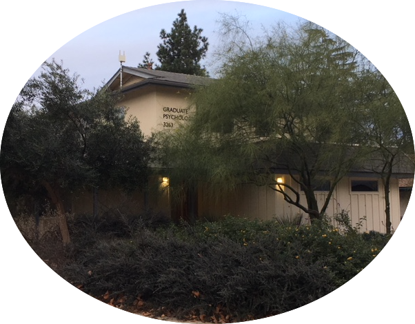

# DBT Coursework

The course readings and materials in DBT are extensive.  In addition, students are provided with a great deal of autonomy.  In other words, you get out of the course what you put into it.  At the same time, Dr. Bedics will notice when books are not underlined and students are not engaged in the material at the graduate level.  A poor performance, lack of participation and engagement in the class are often reflected in poor letters of recommendation or students simply not requesting a letter of recommendation. 

**Points to Consider**

1. The readings are extensive and for most students this course is an elective on top of a full-time schedule. Students should be prepared to complete the readings and adjust their time accordingly.  

2. The majority of students do not receive an _A_ in DBT courses.  An _A_ requires exceptional work across all assignments with the heaviest weight being placed on the final paper, presentation, and exam.  Students who perform best are preparing for their final paper and presentation throughout the semester and not at the end of the semester.

3. All courses are offered on the Thousand Oaks Campus at the Bell House (Graduate Psychology).  The DBT Basics and Suicide courses start at 9AM on Wednesday and end at Noon.  DBT Team follows from noon until 2PM. All supervision in Thousand Oaks at times that fit with Dr. Bedics' schedule.  Students have to adjust their schedule accordingly so they are on time (ideally early) for all appointments.  

