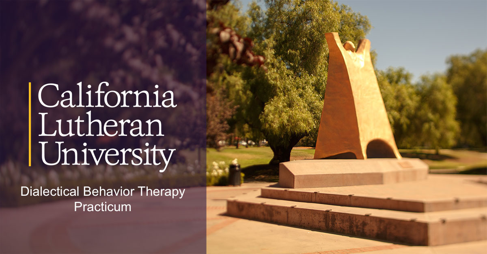

--- 
title: "DBT Practicum Handbook At California Lutheran University"
author: "Jamie Bedics, Ph.D., ABPP"
date: "2019-09-10"
bibliography: book.bib
description: Everything you need to know to successfully complete the DBT Practicum
  at CLU.
documentclass: book
github-repo: jdbedics/dbthandbook
link-citations: yes
site: bookdown::bookdown_site
biblio-style: apalike
---

# Overview {-}

Welcome to the DBT Practicum at CLU!  The following pages include procedures and tips for the successful completion of the practicum.

**History**

The DBT practicum at CLU began in 2010 with the purpose of providing doctoral students at CLU with advanced training in dialectical behavior therapy.  THE CLU-DBT training program was developed by Dr. Jamie Bedics and in collaboration with the developer of DBT, Dr. Marsha Linehan, at the University of Washington. 

The majority of DBT practitioners in the community have received their training post-licensure.  Trainings are provided through groups such as the <a  href="https://behavioraltech.org/">**Linehan Institute**</a>.  These represent the gold standard in DBT training.  At the same time, they are both costly and time consuming.  Dr. Linehan recognized this limitation and received a training grant from the National Institute of Health to develop methods for disseminating DBT at the graduate level.  Cal Lutheran was one of the first universities to implement DBT training based on this grant.  

**Pathways to learning DBT at CLU**

1. *Full DBT Practicum with Supervision* (min. 6-unit elective) - The most typical path is for interested students to take the two course electives (DBT Basics and Suicidology) during their second year of doctoral work while simultaneously being supervised by Dr. Bedics in their first practicum at CLU. Students often take the optional mindfulness course in the summer for an additional 3-unit elective and a total of 9-elective units. 

    * Two courses + Second Year Practicum with Dr. Bedics (6 students max per year)
    * Two courses + 3rd Year Practicum with Dr. Bedics (1 student per year)

2. *No practicum + Course Electives* - Students are free to take any of the courses offered by Dr. Bedics at anytime during their doctoral training at CLU without supervision and personal feedback on performance.

**What does the Full DBT Practicum involve?**

I. DBT Coursework

    1. Behavioral Therapy (PSYD 745 Required Spring of first year)
    2. DBT Basics (Fall Semester)
    3. Suicide Assessment and Crisis Management (Spring Semester)
    4. Mindfulness (Optional; Every Other Summer)
    5. DBT Skills Training (Optional but Recommended; Summer)

Course descriptions can be found at the <a  href="https://www.callutheran.edu/academics/graduate/psyd-clinical-psychology/dbt.html">**Cal Lutheran Website**</a>. 

<h5 align="center"></h5> 

Mindfulness Silent Retreat 2018 in Malibu, CA

 

<h5 align="center"></h5> 

Mindfulness Silent Retreat 2017 in Santa Barbara, CA

 

 

 II. Practicum Supervision with Dr. Bedics

Students in the DBT Practicum primarily conduct behavior therapy and see individual clients (adults and teens).  Students are more likely to be given clients who have reported recent suicidal behavior.  It is rare for a student to have a case for comprehensive DBT unless the student agrees to stay beyond their one year practicum or they are in their third year practicum.

Responsibilities include:
  
    1. Shadow Dr. Bedics conduct phone screenings and assessment for the DBT Clinic
    2. Participate in DBT Skills Training Class with Dr. Bedics and co-lead portions of the group (as available)
    3. Participate on DBT Team (Required)
    4. Learn how to evaluate sessions as being consistent or inconsistent with DBT (i.e., rate adherence)
    5. Conduct phone coaching with clients consistent with DBT principles (as needed)

**Application process for the Full DBT Practicum**

Students at CLU can apply for the DBT practicum during the second semester of their first year in the doctoral program.  Requirements including the following:

  * Approval by their academic advisor in the doctoral program to take elective courses in their second year.
  * Approval by the Director of Clinical Training in the doctoral program.
  * Good academic standing.
  * Successful completion of the course in Behavioral Therapy (PSYD745) with a passing grade and the following:
    * Demonstrated a high degree of professionalism (e.g., being on time to class).
    * Clearly engaged in the material and participated in a professional manner in the classroom. 
    * Demonstrated a high degree of conscientiousness in completing assignments.
  * Talk to a current DBT Practicum student about the challenges and benefits of taking DBT.  
  * A final interview with Dr. Bedics following the applicant having met all of the above requirements and having read this manual.

