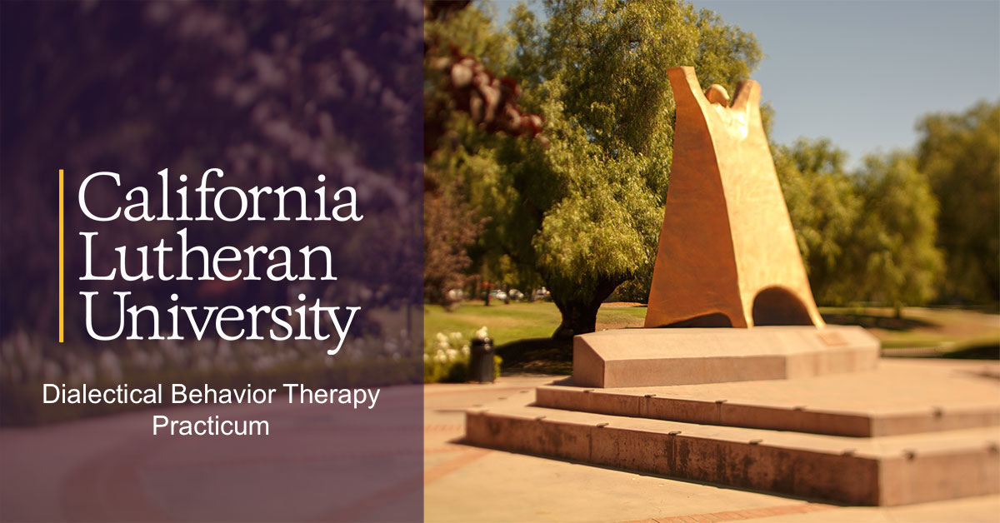

--- 
title: "DBT Practicum Handbook At California Lutheran University"
author: "Jamie Bedics, Ph.D., ABPP"
date: "`r Sys.Date()`"
cover-image: docs/images/kyoto.png
bibliography: book.bib
description: Everything you need to know to successfully complete the DBT Practicum
  at CLU.
documentclass: book
github-repo: jdbedics/dbtpracticum
link-citations: yes
site: bookdown::bookdown_site
biblio-style: apalike
---

# Overview {-}

Welcome to the DBT Practicum at CLU!  The following pages include procedures and tips for the successful completion of the practicum.

**History**

The DBT practicum at CLU began in 2010 with the purpose of providing doctoral students at CLU with advanced training in dialectical behavior therapy.  THE CLU-DBT training program was developed by Dr. Jamie Bedics in collaboration with the developer of DBT, Dr. Marsha Linehan, at the University of Washington. The vast majority of DBT practitioners have received their training in DBT post-licensure.  These classes, offered through the <a  href="https://behavioraltech.org/">Linehan Institute</a>, are the gold standard in DBT training but are both costly and time consuming.  Cal Lutheran was one of the first sites to implement the DBT training at the graduate level consistent with the standards taught at the University of Washington.  

**What does the Practicum involve?**

The DBT practicum at CLU consists of the following:

1. Coursework (minimum of 6-elective units)

2. DBT supervision with Dr. Bedics in behavior therapy and DBT.

*Coursework*

1. Behavioral Therapy (PSYD Required Spring of first year)

2. DBT Basics (Fall Semester)

3. Suicide Assessment and Crisis Management (Spring Semester)

4. Mindfulness (every other summer)

5. DBT Skills Training (summer; optional)

Course descriptions can be found at the <a  href="https://www.callutheran.edu/academics/graduate/psyd-clinical-psychology/dbt.html">Cal Lutheran Website</a>.  

*DBT Practicum Supervision*

Students in the DBT Practicum primarily conduct behavior therapy and see individual (adults and teens), couples, or families from the *general clinic*.  Students in the DBT practicum are, however, more likely to be given clients who report recent suicidal behavior.

In terms of DBT specific training, students sit in and watch Dr. Bedics conduct phone intakes, individual assessments, and also DBT Skills Training classes (i.e., DBT's version of group therapy).  Practicum students practice teaching DBT Skills with Dr. Bedics and get in vivo feedback and support.

**Student Options for taking DBT at CLU**

1. DBT Practicum with Supervision (min. 6-unit elective) - The most typical path is for interested students to take the two course electives (DBT Basics and Suicidology) during their second year while simultaneously being supervised by Dr. Bedics in their first practicum at CLU. Students often take the option mindfulness course in the summer for an additional 3-unit elective and a total of 9-units of electives. 

    * It is less common but students can apply to take the practicum in their 3rd or 4th year of training. 

2. Course Electives (no supervision) - Students are free to take any of the courses offered by Dr. Bedics at anytime during their training. 

**Application process for DBT Practicum**

Students at CLU can apply for the DBT practicum during the second semester of their first year in the doctoral program.  Requirements including the following:

  * Approval by their academic advisor in the doctoral program to take elective courses in their second year.
  * Approval by the Director of Clinical Training in the doctoral program.
  * Good academic standing.
  * Successful completion of the course in behavioral therapy with a passing grade and the following:
    * Demonstrated a high degree of professionalism (e.g., being on time to class)
    * Clearly engaged in the material and participated in a professional manner
    * Demonstrated a high degree of conscientiousness in completed assignments
  * An interview with Dr. Bedics following the student having read this manual.

