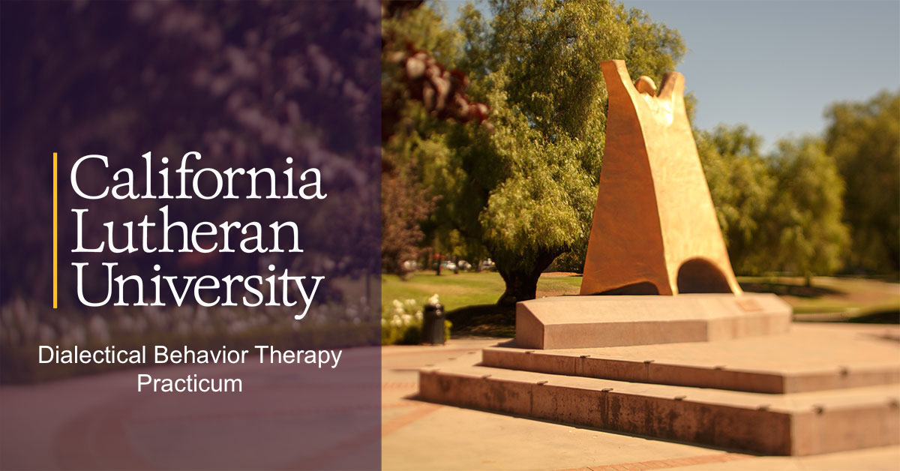

--- 
title: "DBT Practicum Handbook At California Lutheran University"
author: "Jamie Bedics, Ph.D., ABPP"
date: "2017-12-31"
cover-image: docs/images/kyoto.png
bibliography: book.bib
description: Everything you need to know to successfully complete the DBT Practicum
  at CLU.
documentclass: book
github-repo: jdbedics/dbtpracticum
link-citations: yes
site: bookdown::bookdown_site
biblio-style: apalike
---

# Overview {-}

Welcome to the DBT Practicum at CLU!  The following pages include procedures and tips for the successful completion of the practicum.

*History*

The DBT practicum at CLU began in 2010 with the purpose of providing doctoral students at CLU with advanced training in dialectical behavior therapy.  THE CLU-DBT training program was developed by Dr. Jamie Bedics in collaboration with the developer of DBT, Dr. Marsha Linehan, at the University of Washington. Dr. Linehan was awarded a training grant from that National Institute of Health to improve the dissemination of DBT at the graduate level. The vast majority of DBT practitioners have received their training in DBT post-licensure.  These courses and classes, are offered through <a  href="https://behavioraltech.org/">Behavioral Tech</a> from the Linehan Institute. Although the gold standard, these courses are costly and can be time consuming.  Cal Lutheran was one of the first sites to implement the gold standard of training provided by Dr. Linehan at the graduate level.  The courses provided by Dr. Bedics are those received directly from Dr. Linehan and the courses he participated in at the University of Washington and during his fellowship in Seattle, WA at the <a  href="http://ebtseattle.com/">Evidence Based Treatment Center of Seattle</a>.  

*What is the Practicum*

The DBT practicum at CLU consists of the following:
1. Coursework
2. DBT supervision with Dr. Bedics in behavior therapy and DBT.

Coursework
1. Behavioral Therapy
2. DBT Basics
3. Suicide Assessment and Crisis Management
4. DBT Skills Training (optional)
5. Mindfulness (every other summer)

Course descriptions can be found at the <a  href="https://www.callutheran.edu/academics/graduate/psyd-clinical-psychology/dbt.html">Cal Lutheran Website</a>.  

*Student Options for taking DBT at CLU*

1. DBT Practicum (6-unit elective) - The most typical path is for interested students to take the two course electives (DBT Basics and Suicidology) in during their second year while simultaneously being supervised by Dr. Bedics in their first practicum at CLU. Students often take the option of mindfulness course in the summer for an additional 3-unit elective and totalling 9-units. 

2. Course Electives - Students are free to take any of the courses offered by Dr. Bedics at during any part of their training.  DBT Practicum students will always have priority and class sized are capped at a smaller number.

*Application process for DBT Practicum*

Students at CLU can apply for the DBT practicum during the second semester of their first year in the doctoral program.  Requirements including the following:

  * Approval by their academic advisor in the doctoral program to take elective courses in their second year.
  * Approval by the Director of Clinical Training in the doctoral program.
  * Good academic standing.
  * Successful completion of the course in behavioral therapy with a passing grade and the following:
    * Demonstrated a high degree of professionalism (being on time to class)
    * Clearly engaged in ther material and participated in a professional manner
    * Demonstrated a high degree of conscientiousness in completed assignments
  * An interview with Dr. Bedics following the student having read this manual.

